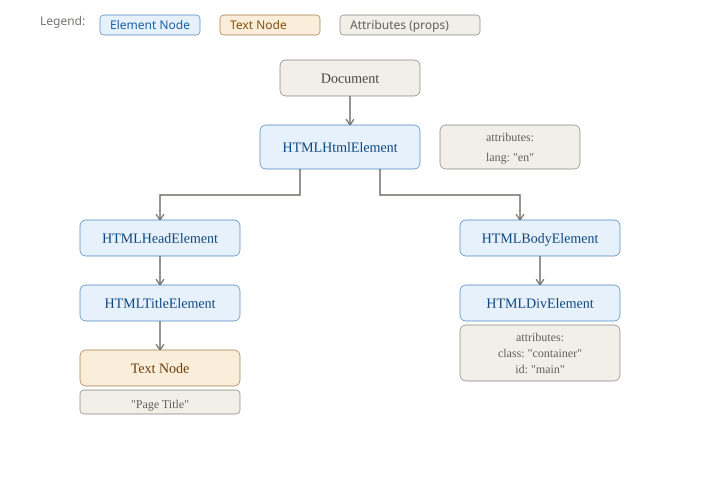
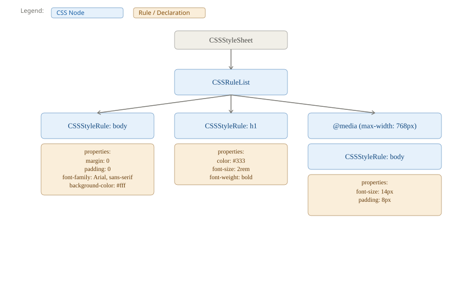
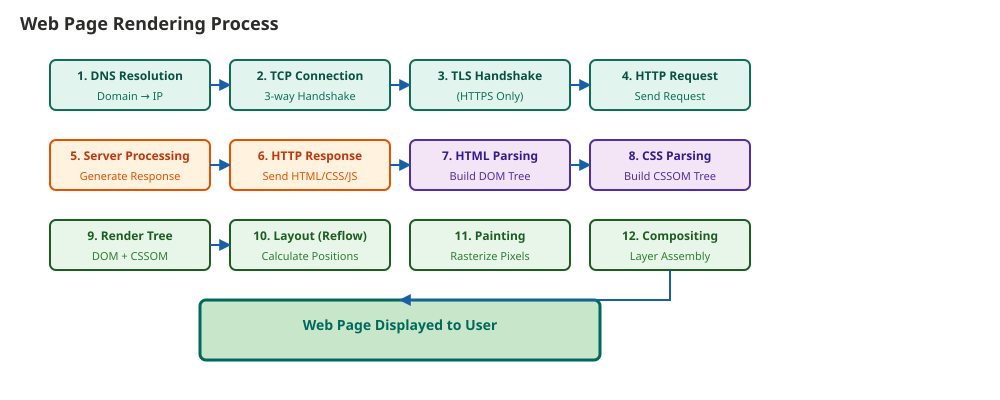
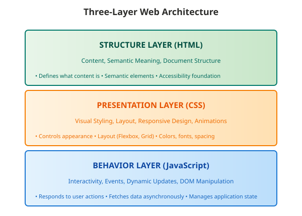

# Introduction to Web Design

## 1. What is Web Design?

### 1.1 Definitions and Scope

**Web Design** is the intersection of visual aesthetics, user experience, technical implementation, and strategic
planning to create functional digital experiences accessible through web browsers.

Web design encompasses:

- **Site Design**: Overall structure and organization of the website
- **Page Design**: Layout and navigation of individual pages
- **Graphic Design**: Visual elements, icons, and imagery
- **Text Design**: Typography, readability, and content hierarchy

**Web Design is NOT**:

- Basic programming
- Database programming
- Server administration
- Content management
- Marketing

Web design is *one part* of web development. Full web software development includes design, programming, databases,
server administration, content management, and marketing.

### 1.2 Core Components of Web Design

Web design is a synthesis of multiple disciplines:

- **Content**: What is being communicated; information architecture and organization
- **Technology**: The tools and platforms used to deliver content (HTML, CSS, JavaScript, servers)
- **Architecture**: How the site is structured; information hierarchy and navigation flow
- **Visual Design**: Aesthetic choices, branding, color schemes, typography
- **Interactivity**: User actions, feedback, and dynamic behavior

### 1.3 Design Approaches and Orientations

Professional web design can be oriented toward different priorities:

- **Technology-Oriented Design**: Emphasizes technical capabilities and features
- **Designer-Oriented Design**: Emphasizes visual aesthetics and creative expression
- **Business-Oriented Design**: Emphasizes company needs and business goals
- **User-Oriented Design**: Emphasizes user needs, usability, and accessibility

### 1.4 The Web Development Process

Professional website development follows a structured 15-step process:

1. **Discussion**: Initial client meetings to understand needs and goals
2. **Research**: Analyze target audience, competitors, and market
3. **Global Design**: Overall site structure and architecture planning
4. **Content Planning**: Identify and organize content to be included
5. **Initial Design**: Create preliminary design concepts and mockups
6. **Client Consultation**: Present designs and gather feedback
7. **Redesign**: Revise based on client feedback
8. **Client Approval**: Obtain sign-off on design direction
9. **Design Other Pages**: Create designs for remaining pages
10. **Client Approval**: Final approval of all page designs
11. **HTML Creation**: Implement structure in HTML
12. **CSS Creation**: Implement visual styling with CSS
13. **Client Presentation**: Present complete site to client
14. **Testing**: Quality assurance, cross-browser testing, functionality verification
15. **Deployment**: Activate the site for public access

### 1.5 Development Team Structure

Professional web projects involve multiple specialized roles:

- **Information Architect**: Designs information structure and navigation
- **Site Manager**: Oversees the site organization and content
- **Visual Designer**: Creates visual design and branding
- **Content Writer**: Creates and organizes written content
- **Technology Specialist**: Evaluates and implements new technologies
- **Backend Engineer**: Develops server-side functionality and databases
- **Sponsor**: Provides budget and organizational support
- **Usability Specialist**: Ensures the site is easy to use and accessible

---

## 2. History of the Web

### 2.1 Key Historical Milestones

- **1956**: Ted Nelson introduces the concept of **hypertext**—interconnected documents that can link to each other.
- **1989-1991**: At CERN (European Organization for Nuclear Research), Tim Berners-Lee develops the foundational
  technologies of the web and becomes chair of the W3C (World Wide Web Consortium):
    - **HTML** for writing web documents
    - **HTTP** protocol for transmitting pages across networks
    - **Client software architecture** for receiving, interpreting, and displaying results
    - Also working on the **Semantic Web** (understanding context, implications, and ambiguity across multiple
      languages)
- **1991**: The system becomes fully operational on NeXT computers at CERN; only one web server exists globally
- **1992-1995**: First specialized web browsers appear
- **1993**: Marc Andreessen develops **Mosaic**, the first graphical web browser
- **1994**:
    - Marc Andreessen and James Clark found Netscape Communications
    - First International Web Conference ("The Woodstock of the Web")
    - Pizza Hut offers pizza orders via the internet
- **1995**: Internet Explorer released by Microsoft
- **1996-1998**: Commercialization of the web begins; browser wars intensify
- **2002**: Internet Explorer dominates with ~95% market share
- **2004**: Firefox released by Blake Ross and Ben Goodger
- **2005**: Over 74 million websites exist

---

### 2.2 Generations of Web Development

Web design has evolved through distinct generations, each with different purposes and technologies:

**First Generation (1961-1993): Academic Foundation**

*Purpose*: Scientific communication for researchers and students

*Characteristics*:

- HTML documents with sequences of text and images
- Unstructured text content
- Resembled books or reports
- Mostly text with minimal graphics

*Technology*: Basic HTML

---

**Second Generation (1994-1996): Information Library**

*Purpose*: Organizing large amounts of indexed, searchable information

*Characteristics*:

- Large volume of organized information
- Indexed content for searching
- Search functionality by parameter
- Icons instead of words
- Background images and banners
- Lists and tables for organization
- Hierarchical, numbered menus
- Visual elements integrated throughout

*Technology*: HTML 2.0

---

**Third Generation (1996-Present): Designer-Oriented**

*Purpose*: Aesthetic and interactive experiences for general users

*Characteristics*:

- Typography and visual design emphasis
- Interaction with page elements
- Sound and animation
- E-commerce capabilities
- Flash and embedded media

*Technology*: HTML 3.2, HTML 4.0, JavaScript, CSS

---

**Fourth Generation (Present): Multimedia and Dynamic**

*Purpose*: Rich interactive applications with real-time data

*Characteristics*:

- Multimedia content and dynamic updates
- Extensive database usage
- Real-time personalization
- Complex interactive features
- Mobile-optimized experiences

*Technology*: HTML5, CSS3, JavaScript frameworks, backend services

---

## 3. Understanding Web Architecture

### 3.1 Client-Server Model

The web operates on a **client-server architecture**—a request-response model where clients request resources and
servers provide them.

**The Client** is any device or program that requests resources:

- Web browsers (Chrome, Firefox, Safari, Edge)
- Mobile applications
- Command-line HTTP clients
- Search engine crawlers

Clients send HTTP requests to servers, receive responses containing HTML, CSS, JavaScript, images, and other assets,
then parse, render, and display the content.

**The Server** is a computer that listens for and responds to requests:

- Listens on specific ports (80 for HTTP, 443 for HTTPS)
- Accepts incoming network connections
- Parses HTTP requests to determine requested resources
- Executes server-side code if necessary
- Sends appropriate HTTP responses

### 3.2 Static vs Dynamic Content

**Static Web Pages**

Static pages are delivered exactly as stored on the server. Every user receives identical content.

*Characteristics*:

- Content fixed in HTML files
- All users receive identical content
- No server-side processing
- Minimal server resource usage
- Fast delivery

*Advantages*:

- Extremely fast (no processing)
- Highly secure (no database connections)
- Easy to cache at CDNs
- Low server requirements
- High reliability

*Disadvantages*:

- Content must be updated manually
- No personalization
- Not suitable for user-specific content
- Changes require redeploying files

*Use Cases*:

- Documentation sites
- Marketing landing pages
- Portfolio websites
- Product pages

---

**Dynamic Web Pages**

Dynamic pages are generated on-demand by server-side code. Content varies based on user identity, request parameters,
database state, or other factors.

*Characteristics*:

- Content generated per request
- Personalized to individual users
- Requires server-side code execution
- Can display real-time, current data
- Higher server resource requirements

*How It Works*:

1. Browser sends HTTP request
2. Server-side code executes
3. Code queries databases and processes logic
4. Server generates unique HTML
5. Browser renders the personalized content

*Advantages*:

- Real-time, always-current content
- Personalization and customization
- User-specific views (accounts, preferences)
- Database-driven (scalable content)
- Single codebase for multiple pages

*Disadvantages*:

- Slower than static (processing required)
- More server resources required
- More complex to develop and maintain
- Database dependencies add complexity
- Caching is more difficult

*Use Cases*:

- Social media feeds
- E-commerce catalogs
- User dashboards
- Content management systems

---

### 3.3 Web Servers and Hosting

**Web Server**: Hardware and software combination that serves web pages to clients.

- *Hardware perspective*: Any computer can be a web server
- *Software perspective*: A computer running web server software (Apache, Nginx, IIS) configured to serve clients

**Static Site Requirements**:

- Web server
- Internet connection

**Dynamic Site Requirements**:

- Web server
- Internet connection
- Application server (separate machine for code execution)
- Database (typically on separate machine)
- Pages generated on-demand for each visitor

**Server Tasks**:

- Receive requests from visitors
- Serve static pages (for static sites)
- Forward requests to application server (for dynamic sites)

---

## 4. The Request-Response Cycle

### 4.1 Step-by-Step Request Flow

Every web page load involves a precise sequence of network communications and processing. Understanding this cycle is
fundamental to web design.

#### **Step 1: DNS Resolution**

The browser must translate a domain name into an IP address before contacting the server.

**DNS Lookup Process**:

The **Domain Name System (DNS)** is a distributed directory service that translates human-readable domain names
(example.com) into IP addresses (192.168.1.1).

*Why DNS exists*: Humans cannot remember hundreds of IP addresses; DNS provides a hierarchical directory.

**Domain Structure**:

```
www.example.com
│   │       │
│   │       └─ Top-level domain (TLD): .com, .org, .edu
│   └───────── Second-level domain: example
└───────────── Subdomain: www
```

**DNS Hierarchy**:

1. **Root nameservers**: Know locations of TLD servers
2. **TLD nameservers** (.com, .org, etc.): Know locations of authoritative servers
3. **Authoritative nameservers**: Store actual DNS records
4. **Recursive resolvers**: ISP's DNS servers that perform lookups

**Query Process**:

1. Browser checks its cache; if not found:
2. Browser queries ISP's recursive resolver
3. Resolver checks its cache; if not found:
4. Resolver queries root nameserver: "Where is .com?"
5. Root responds with TLD server address
6. Resolver queries TLD server: "Where is example.com?"
7. TLD responds with authoritative nameserver address
8. Resolver queries authoritative nameserver: "What's the IP for www.example.com?"
9. Authoritative nameserver responds with IP address
10. Resolver caches result and returns IP to browser
11. Browser caches result

**DNS Lookup Order** (browser caching):

1. Browser cache
2. Operating system cache
3. Router cache
4. ISP DNS server
5. Root nameserver → TLD nameserver → Authoritative nameserver

---

#### **Step 2: TCP Connection Establishment**

Once the IP address is known, the browser establishes a **TCP (Transmission Control Protocol)** connection.

**What is TCP?**

Transmission Control Protocol is a connection-oriented protocol that ensures reliable, ordered delivery of data. Unlike
UDP, TCP guarantees that all packets arrive and in the correct sequence.

**Key Characteristics**:

- **Reliable Delivery**: All packets arrive at destination in correct order; missing packets are automatically
  retransmitted
- **Error Checking**: Each packet includes checksums for verifying integrity; corrupted packets are discarded
- **Flow Control**: Prevents overwhelming the receiver by managing transmission rate
- **Congestion Control**: Adjusts speed based on network conditions
- **Ordered Delivery**: Data arrives in the same order sent, even if packets take different network paths

**The TCP Three-Way Handshake**:

Before data transfer, TCP establishes connection through three steps:

1. **SYN (Synchronize)**: Client sends synchronization packet with initial sequence number—requesting connection
2. **SYN-ACK (Synchronize-Acknowledge)**: Server acknowledges client's sequence and sends its own—confirming willingness
   to communicate
3. **ACK (Acknowledge)**: Client acknowledges server's sequence—completing handshake

Both parties now verify they can send and receive reliably.

**Why TCP for HTTP?**: Web browsers use TCP because it guarantees reliable delivery. Missing bytes in HTML documents
would render them unusable; TCP's reliability guarantee is essential.

---

#### **Step 3: TLS/SSL Handshake (HTTPS Only)**

For secure HTTPS connections, a **TLS (Transport Layer Security)** handshake follows TCP to establish encryption.

**What is TLS?**

Transport Layer Security is a cryptographic protocol providing security, privacy, and data integrity over networks. It
encrypts all data transmitted over TCP, protecting against eavesdropping, tampering, and man-in-the-middle attacks.

**Why TLS is Essential**:

Without TLS, all data between client and server is plaintext—visible to anyone monitoring network traffic. This includes
login credentials, payment information, and private communications. TLS encrypts this data so only the intended
recipient can read it.

**The TLS Handshake Steps**:

1. **Client Hello**: Client initiates by sending:
    - Supported TLS versions
    - Supported cipher suites (encryption algorithms)
    - Random number unique to this session
    - Extensions (optional features like server name indication)

2. **Server Hello**: Server responds by selecting:
    - TLS version to use (highest mutually supported)
    - Cipher suite from client's list
    - Server's random number for this session
    - Extensions it will use

3. **Certificate Exchange**: Server sends digital certificate containing:
    - Server's public key
    - Server's identity (domain name, organization)
    - Certificate Authority's digital signature proving authenticity
    - Certificate validity period

4. **Certificate Verification**: Client verifies server's certificate:
    - Checks if signed by trusted Certificate Authority
    - Verifies domain name matches
    - Confirms certificate hasn't expired
    - Validates certificate hasn't been revoked

5. **Key Exchange**: Both parties perform cryptographic key exchange:
    - For RSA: Client encrypts "pre-master secret" with server's public key; only server can decrypt
    - For ECDHE: Client and server perform mathematical exchange only they can compute
    - Both derive identical session keys from random numbers and exchanged secrets

6. **Cipher Spec Change**: Both parties announce switching to encrypted communication

7. **Finished Messages**: Both send encrypted verification messages proving handshake succeeded and nothing was
   altered—includes hash of all previous handshake messages

**Session Keys and Encryption**:

From the handshake, both parties derive:

- **Encryption key**: Encrypts data sent from client to server
- **Decryption key**: Decrypts data received from server
- **MAC key**: Creates message authentication codes proving data integrity

These keys are temporary and unique to this session. **Forward secrecy** means compromising one session's keys doesn't
compromise others.

**Modern TLS Improvements** (TLS 1.3):

- Reduced handshake messages (faster connection)
- Removed weak cipher suites (more secure by default)
- Perfect forward secrecy built-in
- 0-RTT mode (resuming connections skip some steps)

---

#### **Step 4: HTTP Request**

The browser sends an **HTTP request** specifying:

- **Method**: GET (retrieve), POST (submit), PUT, DELETE, etc.
- **Path**: Resource location (e.g., /index.html, /api/users)
- **Headers**: Metadata including:
    - Host: Domain name
    - User-Agent: Browser information
    - Accept: Accepted content types
    - Accept-Language: Preferred languages
    - Cookies: Stored session/tracking data
- **Body** (optional): Data for POST/PUT requests

---

#### **Step 5: Server Processing**

Server receives request and determines response:

- **Static resources**: Read files from disk
- **Dynamic content**: Execute code, query databases, generate HTML

---

#### **Step 6: HTTP Response**

Server sends HTTP response with:

- **Status code**: 200 (OK), 404 (Not Found), 500 (Error), 301 (Redirect)
- **Headers**: Metadata including Content-Type, caching instructions, cookies
- **Body**: Actual content (HTML, JSON, images)

---

#### **Step 7-12: Rendering the Web Page**

The browser parses the response and constructs the visual display:

**7. HTML Parsing**: Browser reads HTML and constructs **DOM (Document Object Model)**—a tree representation where each
HTML element becomes a node.



**8. CSS Parsing**: CSS is fetched and parsed into **CSSOM (CSS Object Model)**—a tree representing all styles and
rules.



**9. Render Tree Construction**: Browser combines DOM and CSSOM to create **render tree**—only visible elements with
computed styles. Elements with `display: none` are excluded; pseudo-elements are included.

**10. Layout (Reflow)**: Browser calculates exact position and size of each element based on:

- Element content
- CSS box model properties
- Parent container dimensions
- Viewport size

**11. Painting**: Browser rasterizes render tree to pixels, applying:

- Colors and backgrounds
- Text rendering
- Borders and shadows
- Opacity and effects

**12. Compositing**: Browser organizes elements into layers for independent rendering, then composites layers together.

**Resource Fetching**: During parsing, discovered resources (CSS, JavaScript, images) trigger additional HTTP requests,
repeating the cycle.



---

### 4.2 Content Rendering Approaches

#### **Server-Side Rendering (SSR)**

Server generates complete, ready-to-display HTML before sending.

*Process*:

1. Browser requests page
2. Server fetches data
3. Server executes code to generate HTML
4. Server sends complete HTML
5. Browser immediately displays content

*Advantages*:

- Fast initial page load (content visible immediately)
- SEO-friendly (complete HTML available)
- Functional without JavaScript
- Reduced browser processing

*Disadvantages*:

- Server processes every request (high resource usage)
- Navigation requires full server round-trips
- Higher latency
- More server infrastructure required

---

#### **Client-Side Rendering (CSR)**

Server sends minimal HTML and JavaScript; browser generates UI.

*Process*:

1. Server sends HTML shell + JavaScript
2. Browser downloads and parses JavaScript
3. JavaScript initializes application
4. Application fetches data from API
5. JavaScript dynamically creates HTML
6. Page becomes interactive

*Advantages*:

- Rich interactivity and smooth transitions
- Fast navigation after initial load
- Reduced server resource usage
- Clear API boundary

*Disadvantages*:

- Slow initial load (download, parse, execute JavaScript first)
- SEO challenges (JavaScript-generated content)
- Requires JavaScript (broken JS breaks site)
- Larger JavaScript bundles

---

#### **Hybrid: Static Generation with Hydration**

Generate HTML at build time, send to client, then "hydrate" with JavaScript.

*Process*:

1. Build time: Generate static HTML from templates
2. User requests page
3. Server sends pre-rendered HTML (instant)
4. Browser displays HTML immediately
5. JavaScript downloads in parallel
6. JavaScript "hydrates" the page (attaches event handlers, state management)
7. Page becomes fully interactive

**Hydration**: JavaScript attaches event listeners and state management to already-rendered HTML without re-rendering.

*Advantages*:

- Fast initial load (static HTML visible immediately)
- SEO-friendly (complete HTML available)
- Smooth transition to interactivity
- Works with and without JavaScript (graceful degradation)

---

### 4.3 Content Delivery Models

| Approach        | Generated          | Speed     | Personalization | Data Freshness      |
|-----------------|--------------------|-----------|-----------------|---------------------|
| **Static**      | Build time         | Fastest   | None            | Stale until rebuild |
| **SSG**         | Build time         | Fastest   | Template-based  | Stale until rebuild |
| **ISR**         | Build + background | Very Fast | Limited         | Minutes to hours    |
| **SSR + Cache** | First request      | Fast      | Full            | Per cache expiry    |
| **Dynamic SSR** | Every request      | Slower    | Full            | Real-time           |
| **CSR**         | Browser            | Varies    | Full            | Depends on API      |

---

## 5. The Three Pillars of Web Technology

### 5.1 HTML: Structure and Content

**HyperText Markup Language** provides semantic structure and meaning to web content.

**Purpose**: HTML annotates content with semantic tags describing content type and hierarchy.

Enables:

- Browsers to apply accessible styling
- Assistive technologies to navigate meaningfully
- Search engines to understand hierarchy
- Proper structure independent of presentation

**Core Responsibility**: Defines ***what*** content is. Should be functional without CSS or JavaScript.

**Key Semantic Elements** (HTML5):

Structural:

- `<header>`: Introductory content, navigation
- `<nav>`: Navigation links
- `<main>`: Primary content
- `<article>`: Self-contained content
- `<section>`: Thematic grouping
- `<aside>`: Tangentially related content
- `<footer>`: Footer information

Content:

- `<h1>`-`<h6>`: Hierarchical headings
- `<p>`: Paragraphs
- `<ul>`, `<ol>`, `<li>`, `<dl>`, `<dt>`, `<dd>`: Lists
- `<table>`: Tabular data
- `<form>`: User input
- ``: Images
- `<audio>`: Audios
- `<video>`: Videos
- `<a>`: Hyperlinks
- `<frames>`: Frames embedding

**Key Principles**:

- Semantic markup enables accessibility, SEO, maintainability
- Elements should describe content meaning, not appearance
- Use `<div>` only when no semantic element fits
- Always include `alt` text on images
- Nest elements properly; never cross-nest

---

### 5.2 CSS: Presentation and Visual Design

**Cascading Style Sheets** controls visual presentation while HTML controls structure.

**Purpose**: CSS transforms semantic HTML into visual design. Controls typography, colors, spacing, layout, and all
visual aspects.

**Core Responsibility**: Defines ***how*** content looks. Site should remain functional if CSS fails to load.

**CSS Rules: The Foundation**

All CSS follows a simple pattern:

```
selector { property: value; }
```

A **rule** consists of:

- **Selector**: Which element(s) to style
- **Declaration block**: One or more property-value pairs enclosed in curly braces
- **Property**: What aspect to change (color, size, spacing)
- **Value**: What to change it to

Multiple properties can be set on a single element.

**Referencing CSS**: CSS must be linked to HTML documents. Three methods:

- **External CSS** (recommended)
    - CSS lives in a separate `.css` file
    - Linked in HTML `<head>` with `<link rel="stylesheet" href="styles.css">`
    - Reusable across multiple HTML files
    - Best for performance and maintainability

- **Internal CSS**
    - CSS written inside HTML `<style>` tags in the `<head>`
    - Affects only that HTML document
    - Useful for single-page styles

- **Inline CSS**
    - CSS written directly on HTML elements as `style` attributes
    - Affects only that element
    - Highest specificity, avoid overusing

**Selectors**:

- **Type**: `p { }` targets all paragraphs
- **Class**: `.warning { }` targets elements with class="warning"
- **ID**: `#header { }` targets element with id="header"
- **Descendant**: `article p { }` targets paragraphs inside articles
- **Child**: `ul > li { }` targets list items directly inside lists
- **Pseudo-classes**: `a:hover { }`, `input:focus { }`
- **Pseudo-elements**: `p::first-line { }`, `h1::before { }`

**Cascade and Specificity**:

**Cascade** means styles flow downward through a document. When multiple rules target the same element,
**specificity** determines which applies.

**Specificity hierarchy** (lowest to highest):

1. Universal selector (zero)
2. Type selectors (lowest)
3. Class selectors
4. ID selectors
5. Inline styles (highest)

**If specificity is equal**, the last rule in source order wins - (id, class, type).

The cascade enables a key principle: more general styles apply first, then more specific styles override them.

**Flow**: *Normal flow* is how browsers naturally lay out HTML elements without CSS interference.

- **Block-level elements** (default):
    - Take up full width available
    - Stack vertically (one per line)
    - Respect margin, padding, and border
    - Examples: `<div>`, `<p>`, `<h1>`, `<section>`

- **Inline elements** (default):
    - Take up only as much width as needed
    - Flow within text (side by side)
    - Ignore top/bottom margin
    - Examples: `<span>`, `<a>`, `<strong>`

- **Inline-block elements**:
    - Flow inline but respect all box model properties
    - Can be sized and have margin/padding on all sides

CSS can change how elements flow using `display` property (`block`, `inline`, `inline-block`, `flex`, `grid`).

**The Box Model**:

Every HTML element is a rectangular box with four layers from inside out:

- **Content**: The element's actual content (text, images, etc.)
- **Padding**: Space inside the box, around content (inside the border)
- **Border**: The edge/outline of the box
- **Margin**: Space outside the box, between elements (outside the border)

All sizing calculations include these layers. Understanding the box model is essential for spacing and layout.

**Layout Systems**:

- **Normal Flow**
    - Default browser layout behavior
    - Block elements stack vertically
    - Inline elements flow horizontally
    - Predictable and simple

- **Flexbox** arranges elements in one dimension (row or column)
    - `flex-direction`: Controls direction (row or column)
    - `justify-content`: Controls spacing along main axis
    - `align-items`: Controls alignment on cross axis
    - `gap`: Space between items
    - Flexible sizing and distribution of items

- **Grid** arranges elements in two dimensions (rows and columns)
    - `grid-template-columns`: Define column layout
    - `grid-template-rows`: Define row layout
    - `gap`: Space between cells
    - `grid-column` / `grid-row`: Place items in specific cells
    - Powerful for complex multi-dimensional layouts

- **Position** removes elements from normal flow
    - `static`: Default (normal flow)
    - `relative`: Positioned relative to its normal position
    - `absolute`: Positioned relative to nearest positioned ancestor
    - `fixed`: Positioned relative to the viewport
    - `sticky`: Fixed when scrolled past a threshold

**Responsive Design:**

Responsive CSS adapts layouts to different screen sizes and devices.

- **Mobile-first approach**
    - Start with mobile styles as the base
    - Use media queries to add complexity at larger sizes
    - Ensures mobile experience is optimized first

- **Media queries** apply styles based on device characteristics
    - `@media (min-width: 768px) { }` applies styles for screens 768px and wider
    - `@media (max-width: 767px) { }` applies styles for screens 767px and narrower
    - Multiple conditions can be combined

- **Common breakpoints**
    - Mobile: up to 767px
    - Tablet: 768px to 1023px
    - Desktop: 1024px and above

- **Fluid layouts**
    - Use percentages instead of fixed pixel widths
    - Use `max-width` to limit growth
    - Use relative units (em, rem) for sizing
    - Allow content to scale with container

- **Flexible images and media**
    - Set `max-width: 100%` on images
    - Scale images with their containers
    - Prevent overflow on smaller screens

---

### 5.3 JavaScript: Behavior and Interactivity

**JavaScript** is the only true programming language of the three core technologies. Adds interactivity and dynamic
behavior.

**Purpose**: Responds to user actions, manipulates content, fetches data, validates input, manages state.

**Core Responsibility**: Defines ***how*** content behaves. Enhances but shouldn't be required for core functionality.

**Core Capabilities**:

- **DOM Manipulation**: Select and modify elements
    - Select by ID, class, tag, or selectors
    - Read and modify content
    - Add/remove classes for styling
    - Create and inject elements
    - Remove elements

- **Event Handling**: Respond to user interactions
    - Click events
    - Form submission
    - Keyboard input
    - Mouse movement
    - Focus/blur events
    - Scroll, resize, load events

- **Asynchronous Operations**: Fetch data without page reloads
    - Fetch from APIs
    - Update page content
    - Handle loading states
    - Provide user feedback

**Modern Capabilities**:

- Arrow functions for cleaner syntax
- Template literals for string interpolation
- Destructuring for cleaner variables
- Async/await for readable asynchronous code
- Modules for code organization
- Classes for object-oriented patterns

---

### 5.4 Layered Architecture

The three technologies form a layered architecture with clear separation:



**HTML** (Structure): Defines **_what content is_**; provides semantic meaning; works standalone

**CSS** (Presentation): Defines **_how content looks_**; completely optional for core functionality

**JavaScript** (Behavior): Defines **_how content behaves_**; enhances but shouldn't be required

**Advantages of Separation**:

- **Maintainability**: Change design with CSS only; add features with JavaScript only
- **Reusability**: Share stylesheets across pages; reuse scripts on multiple pages
- **Accessibility**: Semantic HTML enables assistive technologies regardless of CSS/JS
- **Performance**: Each layer optimized independently
- **Resilience**: If CSS fails, content remains readable; if JS fails, core functionality remains
- **Scalability**: Different specialists can work on each layer

**Graceful Degradation**:

Progressive enhancement means building in layers:

1. Start with semantic HTML (works everywhere)
2. Add CSS for visual design (graceful when missing)
3. Add JavaScript for enhanced interactivity (graceful when unavailable)

---

## 6. URLs and Web Addressing

### 6.1 URL vs URI

A **URI (Uniform Resource Identifier)** is the broader concept—any string that identifies a resource.

A **URL (Uniform Resource Locator)** is a specific type of URI that specifies ***how to locate*** a resource
(its address).

**All URLs are URIs, but not all URIs are URLs.** Example: `mailto:user@example.com` is a URI (identifies an email
address) but not a URL (doesn't locate it on the web).

For web development, you'll use URLs almost exclusively.

---

### 6.2 URL Components

A **URL (Uniform Resource Locator)** specifies the location of a resource on the web.

```
https://www.example.com:443/path/to/page?param1=value1&param2=value2#section
└──┬──┘ └──┬──────────────┘ └─┬──┘ └──┬────────────────────────────────┘ └─┬────┘
   |       |                 |    |                                       |
Scheme  Authority           Path  Query                                Fragment
```

**1. Scheme**: Communication protocol

- `http://`: Unencrypted HTTP
- `https://`: Encrypted HTTP over TLS
- `ftp://`: File transfer protocol
- `file://`: Local file system

**2. Authority**: Contact location

- **Host**: Domain name or IP address (www.example.com)
- **Port** (optional): Specific port (80 for HTTP, 443 for HTTPS)
- **Userinfo** (optional): Username and password (rarely used in modern web)

**3. Path**: Server-side location

- Hierarchical like filesystem: `/path/to/page.html`
- Starts with `/`
- Case-sensitive on Unix servers; case-insensitive on Windows

**4. Query**: Parameters sent to server

- Starts with `?`
- Format: `key=value` pairs separated by `&`
- Optional data for server processing
- Example: `?search=design&sort=newest`

**5. Fragment**: Section within document

- Starts with `#`
- Processed by browser, not sent to server
- Links to named sections or JavaScript routes
- Example: `#contact-section` jumps to element with id="contact-section"

---

## 7. Web Standards and Browser Compatibility

### 7.1 The W3C and Web Standards

The **World Wide Web Consortium (W3C)**, founded by Tim Berners-Lee, develops and maintains web standards. Standards
ensure the web remains open, accessible, and interoperable.

**Key W3C Standards**:

- HTML specification
- CSS specifications
- SVG (Scalable Vector Graphics)
- WCAG (Web Content Accessibility Guidelines)
- DOM (Document Object Model) APIs

**Why Standards Matter**:

Without standards, each browser would implement features differently. Developers would need separate code for each
browser. With standards, properly written HTML renders consistently across all major browsers.

**Standards Development Process**:

1. **Working Draft**: Initial proposal; subject to major changes
2. **Candidate Recommendation**: Feature-complete; seeking implementation feedback
3. **Proposed Recommendation**: Mature, ready for endorsement
4. **W3C Recommendation**: Official standard

**Living Standards**:

Modern standards (HTML, CSS) are now "living standards"—continuously updated rather than versioned. Features are added
as they mature.

---

### 7.2 HTML and CSS Evolution

**HTML Evolution**:

- **HTML (1991)**: Original proposal by Tim Berners-Lee
- **HTML 2.0 (1995)**: First formal standard; forms and tables
- **HTML 3.2 (1997)**: Applets, text flow around images
- **HTML 4.01 (1999)**: Strict separation of structure (HTML) and presentation (CSS)
- **XHTML 1.0 (2000)**: HTML as XML; strict syntax; failed due to excessive strictness
- **HTML5 (2014)**: Modern standard; simplified DOCTYPE, semantic elements, multimedia, APIs
- **HTML (2022-present)**: Living standard; continuous updates

**Key HTML5 Features**:

- Simplified DOCTYPE: `<!DOCTYPE html>`
- Semantic elements: `<header>`, `<nav>`, `<article>`, `<section>`
- Multimedia support: `<video>`, `<audio>`, `<canvas>`
- Improved forms and validation
- APIs for offline storage and geolocation

**CSS Evolution**:

- **CSS1 (1996)**: Basic styling—fonts, colors, spacing
- **CSS2 (1998)**: Positioning, z-index, media types
- **CSS2.1 (2011)**: Refined CSS2; removed poorly-supported features
- **CSS3 (2011-present)**: Modularized into independent specifications; each advances independently

**Key CSS3 Modules**:

- **Selectors**: `:nth-child()`, attribute selectors
- **Media Queries**: Responsive design
- **Flexbox**: One-dimensional layouts
- **Grid**: Two-dimensional layouts
- **Transforms**: Rotation, scaling, skewing
- **Animations and Transitions**: Motion and effects
- **Custom Properties**: CSS variables

---

### 7.3 Browser Compatibility and Testing

**Browser Market Share** (2024-2026):

**Desktop**:

- Chrome: ~65%
- Edge (Chromium): ~10%
- Safari: ~9%
- Firefox: ~7%

**Mobile**:

- Safari (iOS): ~27%
- Chrome (Android): ~62%
- Samsung Internet: ~5%

**Browser Engines**:

- **Chromium** (Chrome, Edge, Samsung Internet): Very consistent
- **WebKit** (Safari): Some unique behaviors
- **Gecko** (Firefox): Mostly standards-aligned

**Testing Strategy**:

1. **Chrome (Chromium baseline)**: Supports latest standards
2. **Safari (WebKit)**: Different engine; essential for iOS users
3. **Firefox (Gecko)**: Standards-focused; catches edge cases
4. **Edge**: Mostly Chromium; rarely has unique issues

**Feature Detection**:

Instead of browser detection, detect feature support and use polyfills for unsupported features.

---

## 8. Principles of Good Web Design

### 8.1 Visual Hierarchy

Visual hierarchy guides users through content by emphasizing importance through size, color, contrast, spacing, and
position.

**Size and Scale**

Larger elements attract attention first. Primary content should be noticeably larger than secondary. Important
calls-to-action should be more prominent than secondary actions.

**Color and Contrast**

High-contrast elements stand out. Important information should have strong contrast against backgrounds. Color alone
shouldn't convey meaning (colorblind users need alternatives).

**Whitespace**

Generous spacing creates breathing room and emphasis. Clustered elements appear less important; spaced elements appear
more important.

**Alignment and Proximity**

Related elements grouped together; consistent alignment creates order and professionalism.

**Reading Patterns**:

- **F-Pattern** (text-heavy pages): Users scan top-left to top-right, down left side, back right. Place key information
  along this path.
- **Z-Pattern** (visual/landing pages): Users scan top-left to top-right, diagonally to bottom-left, across to
  bottom-right. Position logo top-left, primary CTA top-right, content along diagonal.

---

### 8.2 Typography and Readability

**Font Selection**:

- **Serif fonts** (Times New Roman, Georgia): Small decorative strokes; convey tradition, formality, authority
- **Sans-serif fonts** (Arial, Helvetica, Roboto): No decorative strokes; appear clean, modern, technical; preferred for
  screens

**Usage Guidelines**:

- Body text on screens: Sans-serif (easier to read at small sizes)
- Headings: Either serif or sans-serif (create contrast with body)
- UI elements: Sans-serif almost exclusively

**Readability Guidelines**:

- **Line Length**: 50-75 characters per line is optimal
- **Line Height (Leading)**: 1.4-1.6 times font size for body text; 1.2-1.3 for headings
- **Contrast**: Minimum 4.5:1 contrast ratio for normal text; 3:1 for large text (18px+)
- **Font Size**: Minimum 16px for body text; 18-20px optimal for long-form reading

**Font Pairing**: Combine serif headings with sans-serif body, or use different weights of single typeface.

---

### 8.3 Color Theory and Psychology

**Color Relationships**:

- **Complementary**: Opposite on color wheel (blue/orange); high contrast, visual energy
- **Analogous**: Adjacent on wheel (blue, blue-green, green); harmonious, calm
- **Triadic**: Evenly spaced (red, yellow, blue); balanced vibrancy
- **Monochromatic**: Variations of one hue; cohesive, elegant

**Color Psychology**:

- **Red**: Energy, urgency, passion, danger (CTAs, errors, sales)
- **Blue**: Trust, calm, professionalism (corporate, medical, financial)
- **Green**: Growth, health, nature, success
- **Yellow**: Optimism, warmth, caution
- **Orange**: Friendly, energetic, affordable (e-commerce CTAs)
- **Purple**: Luxury, creativity
- **Black**: Elegance, power, sophistication
- **White**: Simplicity, cleanliness, spaciousness

**Color Palette Strategy**:

The **60-30-10 Rule**:

- **60%**: Dominant color (neutral background)
- **30%**: Secondary color (brand color, main areas)
- **10%**: Accent color (CTAs, highlights)

**Accessibility**:

Approximately 8% of men and 0.5% of women have color blindness. Never rely on color alone to convey meaning:

- **Poor**: Red text for errors, green for success
- **Good**: Icons + color (✗ Error, ✓ Success)

---

### 8.4 Usability and Accessibility

**Usability Principles**:

- **Consistency**: Similar elements look and behave similarly
- **Feedback**: System informs users of actions and state changes
- **Error Prevention**: Design prevents errors before they occur
- **Recognition Over Recall**: Make options visible; don't require memorizing
- **Flexibility**: Support both novice and expert users

**Accessibility Requirements**:

- **Semantic HTML**: Use appropriate elements (buttons for actions, links for navigation, headings for hierarchy)
- **Alternative Text**: Every image needs descriptive `alt` text
- **Keyboard Navigation**: All interactive elements must be keyboard accessible
- **Focus Indicators**: Never remove focus outlines without alternatives
- **ARIA Labels**: Use when semantic HTML is insufficient
- **Color Contrast**: Meet WCAG standards
- **Responsive Text**: Allow text scaling to 200% without breaking layout

**WCAG Standards** (Web Content Accessibility Guidelines):

- **Level A**: Basic compliance
- **Level AA**: Enhanced compliance (recommended)
- **Level AAA**: Highest compliance (stricter)

---

### 8.5 Performance and Page Speed

**Core Web Vitals**:

- **Largest Contentful Paint (LCP)**: Time until largest content is visible. Goal: < 2.5 seconds
- **First Input Delay (FID)**: Delay from first interaction to response. Goal: < 100 milliseconds
- **Cumulative Layout Shift (CLS)**: Visual stability during load. Goal: < 0.1

**Optimization Techniques**:

- **Minimize HTTP Requests**: Fewer resources = fewer round-trips
- **Optimize Images**: Compress, use modern formats (WebP), serve responsive images
- **Minify CSS and JavaScript**: Remove unnecessary characters
- **Enable Compression**: Gzip or brotli compress text files (70% reduction)
- **Browser Caching**: Set cache headers for static resources
- **Content Delivery Networks (CDNs)**: Serve from geographically closer servers
- **Reduce JavaScript**: Minimize blocking operations; use defer/async

---

## 9. File Organization and Structure

### 9.1 Web Root

The **web root** is the directory containing all publicly accessible files.

**Typical Structure**:

```
/var/www/html/              (web root)
├── index.html              (homepage)
├── about.html
├── contact.html
├── css/
│   ├── style.css
│   └── reset.css
├── js/
│   ├── main.js
│   └── utils.js
├── images/
│   ├── logo.png
│   ├── banner.jpg
│   └── icons/
└── assets/
    └── downloads/
```

**Best Practices**:

- Use lowercase names
- Use hyphens for multi-word names (not underscores): `contact-page.html`
- Use semantic names: `header.css` not `style1.css`
- Group related files in directories
- Use consistent naming conventions

---

### 9.2 Paths

**Absolute Paths**: Full path from domain root

- Always start with `/`
- Work from any page: `/css/style.css`
- Break if domain changes
- **Recommended for consistency**

**Relative Paths**: Path relative to current file

- `./style.css`: File in current directory
- `../css/style.css`: Go up one level, then to CSS
- Break if file moves; harder to maintain

---

## Summary

Web design is a multidisciplinary field combining visual aesthetics, user experience, technical implementation, and
strategic planning. The three pillar technologies (HTML, CSS, JavaScript) with proper separation of concerns provide a
robust foundation for building everything from simple static sites to complex interactive applications.

Understanding the request-response cycle, browser rendering, and web standards enables designers and developers to
create effective, accessible, performant experiences across all devices and platforms.
